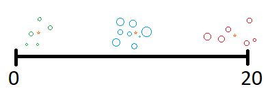

# K-Means-Clustering
A simple k-means clustering (12 data between 0-20 and 3 clusters) 
# K-means: 
The K-means clustering is an unsupervised machine learning algorithm that is used to find groups that have not been explicitly labelled in the data.

Code:
In this code, we have 12 data 12 between 0-20 and we choose k as 3 to find 3 clusters. 

